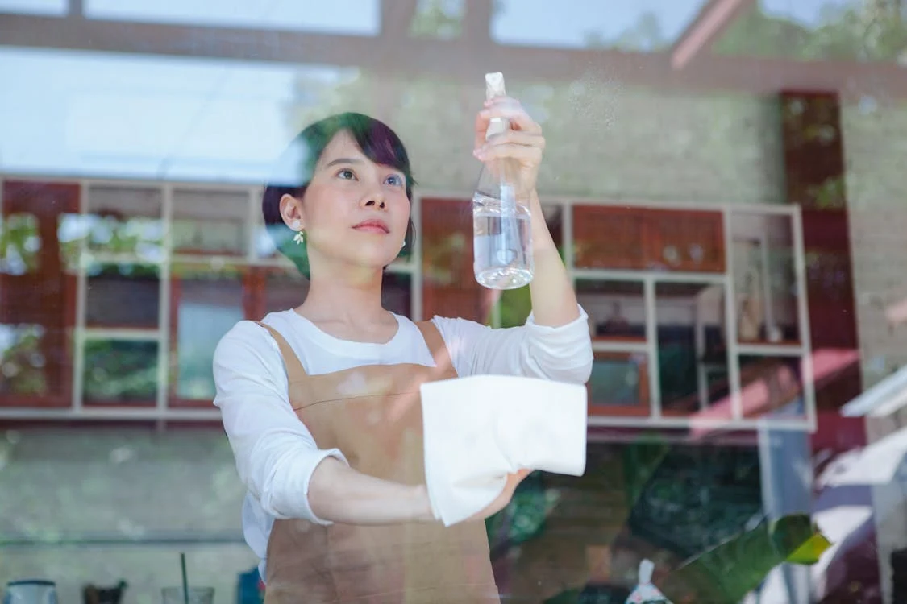

# Làm maid chuyên nghiệp

### 1. Quản lý Gia đình & Công việc Nhà

Đây là nền tảng để ngôi nhà của bạn luôn sạch sẽ, ngăn nắp và hoạt động trơn tru. Chúng ta sẽ học cách tổ chức và thực hiện các công việc hàng ngày một cách hiệu quả nhất.

* Kỹ thuật Dọn dẹp và Vệ sinh Nhà cửa:
    * Lập kế hoạch dọn dẹp hàng ngày, hàng tuần, hàng tháng.
    * Các kỹ thuật làm sạch từng khu vực: phòng khách, phòng ngủ, nhà bếp, phòng tắm.
    * Sử dụng và lựa chọn các loại hóa chất, dụng cụ dọn dẹp an toàn, hiệu quả.
    * Thực hành:
        * Quét nhà, hút bụi, lau nhà đúng cách.
        * Làm sạch và khử trùng phòng tắm (bồn cầu, bồn rửa mặt, vòi sen).
        * Vệ sinh nhà bếp (bếp nấu, bồn rửa, mặt bàn, hút mùi).
        * Lau chùi cửa kính, gương.
        * Dọn dẹp, sắp xếp lại đồ đạc trên các bề mặt (bàn, kệ).
* Giặt giũ & Chăm sóc Quần áo: (Theo yêu cầu của bạn, mục này được làm rõ và tách ra để dễ hình dung)
    * Phân loại quần áo (màu sắc, chất liệu, mức độ bẩn).
    * Chọn chế độ giặt phù hợp cho từng loại vải (máy giặt).
    * Các kỹ thuật giặt tay cho đồ nhạy cảm.
    * Sử dụng bột giặt, nước xả vải hiệu quả và tiết kiệm.
    * Phơi hoặc sấy quần áo đúng cách.
    * Gấp và cất quần áo gọn gàng.
    * Ủi (là) quần áo và cách bảo quản bàn ủi.
    * Xử lý các vết bẩn thông thường.
* Rửa bát & Vệ sinh Khu vực Bếp: (Theo yêu cầu của bạn, mục này được làm rõ và tách ra)
    * Nguyên tắc làm sạch bát đĩa sau bữa ăn (cạo thức ăn thừa, tráng sơ).
    * Rửa bát bằng tay: kỹ thuật, sử dụng nước rửa bát và miếng rửa bát hiệu quả.
    * Sử dụng máy rửa bát: sắp xếp bát đĩa, chọn chương trình rửa, sử dụng viên/bột rửa.
    * Làm sạch bồn rửa bát và khu vực xung quanh.
    * Vệ sinh thùng rác và xử lý rác thải.
    * Lau chùi mặt bếp, tủ bếp sau khi nấu ăn.
* Sắp xếp, Tổ chức các Khu vực trong Nhà:
    * Nguyên tắc "ít hơn là nhiều hơn": loại bỏ đồ không dùng đến (decluttering).
    * Tổ chức tủ quần áo, ngăn kéo, tủ bếp, kho chứa đồ.
    * Sử dụng các giải pháp lưu trữ thông minh (hộp, kệ, túi).
    * Duy trì sự ngăn nắp hàng ngày.
* Quản lý Tài nguyên Gia đình (Điện, Nước, Gas):
    * Các mẹo tiết kiệm điện trong gia đình (sử dụng thiết bị, tắt khi không cần thiết).
    * Sử dụng nước hiệu quả và tiết kiệm (kiểm tra rò rỉ, tái sử dụng nước).
    * An toàn khi sử dụng gas và các thiết bị sưởi ấm.
    * Đọc và hiểu hóa đơn điện, nước, gas.

### 2. Nấu ăn & Nghệ thuật Ẩm thực Gia đình

Trái tim của ngôi nhà thường nằm ở căn bếp. Học cách nấu những bữa ăn ngon, dinh dưỡng và an toàn là một kỹ năng tuyệt vời.

* Lập Kế hoạch Bữa ăn:
    * Lên thực đơn cho tuần/tháng dựa trên ngân sách và sở thích.
    * Kiểm tra kho và tủ lạnh trước khi đi chợ/siêu thị.
    * Lập danh sách mua sắm thông minh.
* Dinh dưỡng và Nhu cầu Ăn uống:
    * Các nhóm thực phẩm chính và vai trò của chúng.
    * Xây dựng bữa ăn cân bằng cho gia đình.
    * Hiểu nhu cầu dinh dưỡng của các thành viên (trẻ em, người già, người hoạt động thể chất).
* Phát triển Công thức Món ăn:
    * Tìm kiếm và đọc hiểu công thức.
    * Đo lường nguyên liệu chính xác.
    * Thực hành các kỹ thuật nấu ăn cơ bản (luộc, hấp, xào, rán, kho).
    * Biến tấu công thức theo khẩu vị gia đình.
* An toàn Thực phẩm và Vệ sinh:
    * Nguyên tắc bảo quản thực phẩm sống và chín.
    * Phòng tránh nhiễm khuẩn chéo.
    * Nhiệt độ nấu ăn an toàn.
    * Vệ sinh tay và dụng cụ nấu nướng.
* Làm bánh và Nghệ thuật Bánh ngọt (Cơ bản):
    * Các loại bột và men nở cơ bản.
    * Kỹ thuật trộn bột, nhào bột.
    * Nướng bánh cơ bản (cupcake, bánh mì đơn giản).
    * Trang trí bánh đơn giản.
* Các Phương pháp Bảo quản Thực phẩm:
    * Bảo quản trong tủ lạnh và tủ đông.
    * Sấy khô, muối chua, đóng hộp (các phương pháp truyền thống).
    * Hút chân không.
* Nấu ăn Tiết kiệm:
    * Tận dụng tối đa nguyên liệu.
    * Sử dụng lại đồ ăn thừa một cách sáng tạo và an toàn.
    * Nấu các món ăn từ nguyên liệu rẻ tiền, theo mùa.
* Chế độ ăn Đặc biệt:
    * Nấu ăn cho người ăn chay/thuần chay.
    * Chế độ ăn không gluten, không lactose.
    * Nấu ăn cho người bị dị ứng thực phẩm.
    * Chế độ ăn kiêng (nếu cần).

### 3. Dinh dưỡng & Sức khỏe Gia đình

Hiểu biết về dinh dưỡng giúp bạn chăm sóc sức khỏe cho cả gia đình một cách chủ động.

* Các Nhóm Chất Dinh dưỡng:
    * Đa lượng: Carbohydrate, Protein, Chất béo (vai trò và nguồn cung cấp).
    * Vi lượng: Vitamin, Khoáng chất (vai trò chính và cách bổ sung).
    * Chất xơ và Nước.
* Nguyên tắc Ăn uống Cân bằng:
    * Khái niệm "Đĩa ăn lành mạnh".
    * Tỷ lệ các nhóm chất trong bữa ăn.
    * Tầm quan trọng của sự đa dạng thực phẩm.
* Cách Đọc Nhãn Thực phẩm và Nhận biết Quảng cáo:
    * Hiểu thông tin trên nhãn: bảng thành phần, giá trị dinh dưỡng, hạn sử dụng.
    * Nhận biết các thuật ngữ quảng cáo gây hiểu lầm ("organic", "natural", "low-fat").
    * Lựa chọn thực phẩm đóng gói thông minh.

### 4. Phát triển Gia đình & Chăm sóc Người thân

Xây dựng mối quan hệ lành mạnh và chăm sóc các thành viên trong gia đình là yếu tố cốt lõi của một tổ ấm hạnh phúc.

* Tâm lý học Trẻ em & Các Giai đoạn Phát triển:
    * Hiểu hành vi và nhu cầu của trẻ ở các độ tuổi khác nhau (sơ sinh, mầm non, tiểu học, dậy thì).
    * Phương pháp kỷ luật tích cực.
    * Khuyến khích sự phát triển toàn diện (thể chất, trí tuệ, cảm xúc, xã hội).
* Giải quyết Xung đột trong Gia đình:
    * Nhận diện các nguyên nhân gây xung đột.
    * Kỹ năng lắng nghe tích cực và thấu hiểu.
    * Tìm kiếm giải pháp hòa bình.
    * Thiết lập ranh giới lành mạnh.
* Kỹ năng Giao tiếp trong Gia đình:
    * Giao tiếp cởi mở và trung thực.
    * Thể hiện sự tôn trọng và yêu thương.
    * Giải quyết vấn đề cùng nhau.
* Những điều Cơ bản về Chăm sóc Trẻ nhỏ:
    * Cho trẻ ăn (sữa mẹ/sữa công thức, ăn dặm).
    * Thay tã, vệ sinh cho trẻ.
    * Thiết lập giờ ngủ và thói quen sinh hoạt.
    * Chăm sóc khi trẻ ốm (nhận biết dấu hiệu bất thường).
    * An toàn cho trẻ trong nhà và ngoài trời.
* Những điều Cơ bản về Chăm sóc Người già:
    * Hiểu các vấn đề sức khỏe thường gặp ở người già.
    * Hỗ trợ di chuyển và sinh hoạt cá nhân.
    * Quản lý thuốc men.
    * Chăm sóc tâm lý và tinh thần.
    * Tạo môi trường sống an toàn, tiện nghi cho người già.

### 5. Nhà ở & Thiết kế Nội thất (Ứng dụng)

Biến không gian sống thành nơi bạn yêu thích và cảm thấy thoải mái, đồng thời đảm bảo an toàn và bền vững.

* Bảo trì và Sửa chữa Nhà cửa (Cơ bản):
    * Kiểm tra định kỳ các vấn đề phổ biến (ống nước rò rỉ, tường nứt, mái nhà).
    * Thay bóng đèn, cầu chì.
    * Sửa chữa vòi nước nhỏ giọt.
    * Thông tắc cống đơn giản.
    * Biết khi nào cần gọi thợ chuyên nghiệp.
* Trang trí Nội thất & Quản lý Không gian:
    * Nguyên tắc sắp xếp đồ đạc để tối ưu không gian.
    * Lựa chọn màu sắc, ánh sáng phù hợp.
    * Sử dụng cây xanh và vật trang trí để làm đẹp nhà.
    * Tạo không gian chức năng cho từng mục đích (làm việc, nghỉ ngơi).
* Thiết kế Môi trường & An toàn trong Gia đình:
    * Lựa chọn vật liệu thân thiện với môi trường (nếu có thể).
    * Giảm thiểu chất độc hại trong nhà.
    * Lắp đặt thiết bị an toàn (báo cháy, báo khói, chống trộm).
    * An toàn điện, gas.
    * Đảm bảo an toàn cho trẻ nhỏ (che ổ điện, rào chắn cầu thang, cất giữ hóa chất).

### 6. May vá & Chăm sóc Vải vóc (Cơ bản)

Những kỹ năng đơn giản có thể giúp bạn tiết kiệm tiền và kéo dài tuổi thọ cho quần áo, đồ vải trong nhà.

* Kỹ thuật May Cơ bản:
    * Sử dụng kim chỉ: khâu vá cơ bản (đính cúc, vá sổ, khâu lược).
    * Sử dụng máy may (cơ bản): xỏ chỉ, điều chỉnh đường may đơn giản.
* Chỉnh sửa Trang phục (Đơn giản):
    * Lên lai quần/váy.
    * Thay cúc, sửa đường chỉ tuột.
    * Vá lỗ nhỏ.
* Khoa học về Vải vóc & Chăm sóc Quần áo:
    * Nhận biết các loại vải thông dụng (cotton, lụa, len, polyester).
    * Đọc và hiểu các ký hiệu giặt là trên nhãn mác.
    * Bảo quản quần áo đúng cách theo chất liệu.
    * Các phương pháp tẩy vết bẩn theo loại vải.
* Tái sử dụng và Sửa chữa Quần áo:
    * Biến tấu quần áo cũ thành đồ mới.
    * Sửa chữa nhỏ để tiếp tục sử dụng.

### 7. Mua sắm Thông minh & Tiêu dùng Bền vững

Trở thành người tiêu dùng thông thái giúp bạn tiết kiệm tiền và góp phần bảo vệ môi trường.

* Kỹ năng Mua sắm Thông minh:
    * So sánh giá cả, tìm kiếm ưu đãi.
    * Lập danh sách mua sắm và tuân thủ.
    * Mua sắm theo mùa, mua số lượng lớn khi cần.
    * Đọc đánh giá sản phẩm.
* Quyền và Nghĩa vụ của Người tiêu dùng:
    * Hiểu về bảo hành, đổi trả hàng.
    * Cách xử lý khiếu nại.
* Nhận diện Quảng cáo:
    * Phân tích thông điệp quảng cáo.
    * Phân biệt nhu cầu và mong muốn.
* Đánh giá Chất lượng Sản phẩm:
    * Kiểm tra chất liệu, độ bền.
    * So sánh giá trị sử dụng với giá tiền.
* Thực hành Tiêu dùng Bền vững:
    * Ưu tiên sản phẩm có nguồn gốc rõ ràng, thân thiện môi trường.
    * Giảm thiểu rác thải từ bao bì.
    * Sử dụng túi đựng đồ cá nhân khi mua sắm.

### 8. Quản lý Tài chính Gia đình

Kiểm soát tài chính giúp đảm bảo sự ổn định và an toàn cho gia đình bạn.

* Lập Ngân sách:
    * Theo dõi thu nhập và chi tiêu.
    * Xây dựng ngân sách hàng tháng/năm.
    * Phân bổ tiền cho các khoản mục cần thiết (ăn uống, nhà ở, đi lại, tiết kiệm).
* Tiết kiệm và Đầu tư (Cơ bản):
    * Xác định mục tiêu tiết kiệm (ngắn hạn, dài hạn).
    * Các hình thức tiết kiệm (gửi ngân hàng).
    * Giới thiệu cơ bản về đầu tư (nếu có).
* Những Kiến thức Cơ bản về Bảo hiểm:
    * Các loại bảo hiểm cần thiết cho gia đình (y tế, nhà cửa, nhân thọ).
    * Hiểu quyền lợi và nghĩa vụ khi tham gia bảo hiểm.
* Lập Kế hoạch Nghỉ hưu (Cơ bản):
    * Tầm quan trọng của việc tiết kiệm sớm cho tuổi già.
    * Các kênh tiết kiệm hưu trí (nếu có).

### 9. Bảo vệ Môi trường tại Gia

Mỗi hành động nhỏ của chúng ta tại nhà đều có thể góp phần bảo vệ hành tinh.

* Giảm lượng Rác thải trong Gia đình:
    * Phân loại rác tại nguồn (hữu cơ, vô cơ, tái chế).
    * Ủ phân hữu cơ từ rác thải nhà bếp.
    * Hạn chế sử dụng đồ dùng một lần.
    * Mua sắm không rác thải (zero-waste).
* Tiết kiệm Năng lượng: (Lặp lại và nhấn mạnh từ mục 1)
    * Sử dụng thiết bị tiết kiệm điện.
    * Tắt đèn, quạt, thiết bị điện khi không sử dụng.
    * Tận dụng ánh sáng tự nhiên.
    * Kiểm soát nhiệt độ trong nhà.
* Sử dụng Sản phẩm Thân thiện với Môi trường:
    * Ưu tiên các sản phẩm tẩy rửa sinh học, tự nhiên.
    * Sử dụng túi vải, bình nước cá nhân.
    * Trồng cây xanh trong nhà.