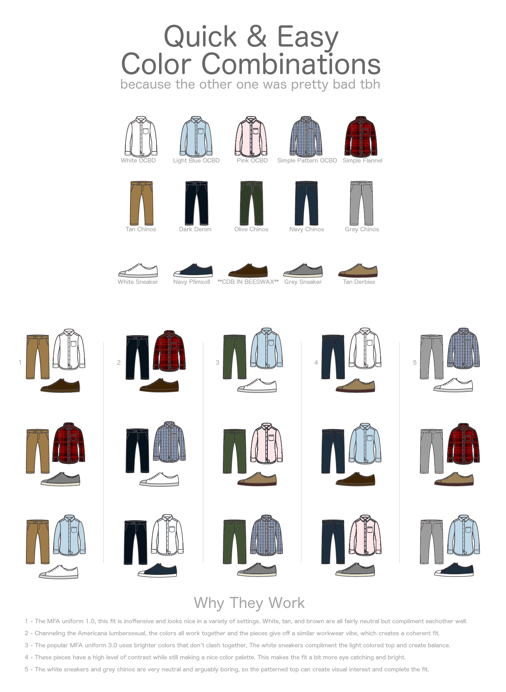

# Phối đồ

Toàn bộ bài viết này được gộp từ ba bài viết của [Tủ của Cốm](https://tucuacom.wordpress.com/), [được đăng trên Voz](https://voz.vn/t/huong-dan-toan-tap-cach-build-tu-%C4%91o-hat-de-cho-nam.233834/) cũng như 3 bài viết trên Wordpress:

- [Các loại áo cơ bản (phần 1)](https://tucuacom.wordpress.com/2021/02/16/tu-do-hat-de-toan-tap-cac-loai-ao-phan-1/)
- [Các loại áo cơ bản (phần 2)](https://tucuacom.wordpress.com/2021/02/18/tu-do-hat-de-nam-gioi-cac-loai-ao-co-ban-phan-2/)
- [Các loại quần cơ bản (phần 1)](https://tucuacom.wordpress.com/2021/02/24/tu-do-hat-de-nam-gioi-cac-loai-quan-co-ban/)

Áo cùng với quần là các món đồ cơ bản nhất. Bạn phải mặc chúng nếu ra đường, bất kể thời gian và thời tiết, bất kể có thích hay không. Dưới đây là các loại áo cơ bản dùng để mặc như lớp trong cùng mà bạn nên, nhưng không nhất thiết, phải có đủ. Số lượng cũng chỉ mang tính chất tham khảo tùy vào nhu cầu và sở thích.

## Các loại áo cơ bản

### 1. Áo phông trơn cổ tròn

Món đồ cơ bản của cơ bản. Vốn được sinh ra phục vụ vai trò áo lót cho nam giới nhưng đã dần trở thành một loại áo mặc riêng phổ biến. Có thể được mặc trong trong các hoàn cảnh casual như đi chơi, đi học, hoạt động thể thao nhẹ… Phần lớn thời gian một người bình thường đều có thể mặc được T-shirt.

-   Độ formal (trang trọng): Thấp
-   Độ linh hoạt phối đồ: Cao, phối với quần jeans hay quần chinos, quần âu, quần short đều đẹp.
-   Chất liệu: Cotton hoặc có thể pha thêm các loại chất liệu nhân tạo khác để có thể co dãn tốt hơn nhưng tỷ lệ nên thấp. Mình thì luôn trung thành với 100% cotton, pha các loại vải nhân tạo vào thường gây nên cảm giác bí, thoáng khí kém đi.
-   Màu sắc: Các màu trung tính như trắng, đen, xám, navy… Nên tránh các loại áo phông in slogan hoặc logo to quá cỡ với màu sắc lòe loẹt. Điều này sẽ làm chiếc áo trông khó phối và có phần “trẩu” hơn rất nhiều.
-   Fit: Regular fit, không quá bó sát cũng không quá rộng. Tay áo kéo đến giữa bắp tay và không đi quá khuỷu tay, ngực không bị bó chặt lộ “núm”, hai tay có thể di chuyển thoải mái mà không bị bó sát vào nách gây cảm giác bất tiện. Dài áo đến tầm giữa phéc-mơ-tuya quần.
-   Thời tiết phù hợp: cả 4 mùa, mùa lạnh thì chọn loại dài tay hoặc mặc thêm các layer khác bên ngoài là được.
-   Số lương: Tùy sở thích, nhưng thường thì 3~4 cái là đủ.
-   Nơi mua tham khảo: Mình hay mua con Uniqlo U Crew Neck trong ảnh, chất vải dày dặn nhưng hơi thô, gần đây có chuyển qua dòng Supima Cotton thì thấy mềm mại thoải mái hơn hẳn, fit cũng đẹp hơn chứ không bị dài áo như con này. Canifa có loại áo cũng 100% cotton chỉ hơn 100k nhưng toàn hết hàng, nếu có dịp mình cũng muốn thử qua.

### 2. Áo OCBD (Oxford Button Down Cloth)

Loại áo sơmi phần cổ có cúc cài xuống (button-down) để không bị gió thổi tốc lên. Áo được may từ loại vải oxford được dệt rất chắc chắn, tạo cảm giác dày, nặng, những đặc điểm này cũng làm áo bớt formal đi hơn nhiều so với một chiếc dress shirt (áo sơ mi mặc cùng bộ suit trong những dịp cần lịch sự). Nếu bạn muốn mặc sơmi đi chơi/đi học để trông vừa chỉn chu vừa thoải mái thì đây là lựa chọn hoàn hảo thay vì dress shirt. Dress shirt quá mỏng và quá nghiêm túc để mặc lẻ trong những trường hợp như này!

-   Độ formal (trang trọng): Trung bình
-   Độ linh hoạt phối đồ: Cao, phối với quần jeans hay quần chinos, quần âu, quần short đều đẹp.
-   Chất liệu: Cotton
-   Màu sắc: Màu xanh biển nhạt được coi là “vua” của loại áo này. Trắng, trắng sọc xanh, xám và thậm chí cả hồng nhạt cũng là những màu rất dễ mặc.
-   Fit: Regular fit hoặc Slim fit tùy vào vóc người và sở thích. Vạt áo dài vừa phải để có thể mặc không sơ vin.
-   Thời tiết phù hợp: Cả 4 mùa. Mùa đông con này mặc với áo len cổ tròn hoặc cổ tim để lộ cổ áo là combo kinh điển. Mùa hè có thể chọn loại ngắn tay.
-   Số lương: 2~3 cái với các màu trên là đủ
-   Nơi mua tham khảo: Uniqlo. Ở Hà Nội với mức giá 500k thì mình chưa biết con nào qua được nó, điểm trừ là vải hơi nhăn và cổ áo không tạo được đường cong “nghệ” cho lắm, nhưng vẫn là quá ổn cho một cuộc tình. Brooks Brothers hay Ralph Lauren là các hãng nổi tiếng khác nhưng giá cũng rất khoai.

### 3. Áo Polo

Áo này thì khỏi phải nói quá quen thuộc rồi. Nếu bạn còn ít tuổi thì hay có ác cảm là đây là loại áo nhìn già mà các bố hay mặc (ít nhất thì là mình đã từng cảm thấy như thế lol).Sau khi thay đổi style thì mình mới thấy đây là loại áo rất dễ phối, nếu biết cách thì sẽ trông không hề già chút nào (thử xắn tay áo lên một nấc và bỏ bớt cúc áo ra xem sao). Lúc cần thì vẫn có thể mặc nghiêm túc tạo cảm giác chỉn chu, trưởng thành được (như khi ra mắt bố mẹ người yêu chẳng hạn lol).

-   Độ formal (trang trọng): Trung bình
-   Độ linh hoạt phối đồ: Cao, phối với quần jeans hay quần chinos, quần âu, quần short đều đẹp.
-   Chất liệu:Áo thường được dệt từ loại vải Pique với bề mặt hơi gai nhẹ nhìn như các lỗ tổ ong giúp thoáng khí. Cotton pha với các chất liệu nhân tạo như polyester là phổ biến nhất, 100% cotton thì càng hay. Ngoài ra áo cũng có thể dệt từ sợi len wool tạo cảm giác mềm mại dễ chịu hơn rất nhiều (nhưng giá thì không được như vậy)
-   Màu sắc: các màu trung tính như đen, navy, xám, trắng…hoặc earth-tone. Nếu bạn có cá tính mạnh và thích mặc vào mùa hè thì các màu rực rỡ như cam, xanh lá cây, xanh biển… cũng là các lựa chọn khác
-   Fit: Tương tự như T-shirt.
-   Thời tiết phù hợp: Mùa xuân, hè, thu. Mùa đông hơi khó mặc.
-   Số lương: 2~3 cái với các màu đã nêu là đủ
-   Nơi mua tham khảo: Bạt ngàn luôn với vô số hãng. Mình thì vẫn trung thành với Uniqlo hehe.

### 4. Áo Dress shirt

Nói đến áo sơmi là 99% mọi người sẽ nghĩ đến chiếc áo này đầu tiên. Chiếc áo kinh điển màu trắng mặc trong các cuộc họp cùng với suit, mặc trong đám cưới, mặc tại lễ tốt nghiệp… nói chung là các dịp cần trang trọng nhất (không tính sự kiện Black tie hay White tie vì hai cái này ở Việt Nam rất hiếm hoặc không tồn tại).

-   Độ formal (trang trọng): Cao
-   Độ linh hoạt phối đồ: Trung bình, phối với quần âu > quần chinos > quần jeans. Càng với các loại quần về sau càng nên cẩn trọng khi phối.
-   Chất liệu: Vì đây là loại áo cho các dịp trang trọng nhất và hay mặc với suit nên bạn cần phải rất khắt khe trong việc chọn chất liệu, nhất là ở một nước nóng ẩm như Việt Nam. 100% cotton là loại áo phổ biến nhất, cao cấp hơn có thể kể đến các loại cotton-silk blend. Vải sợi tre thì rẻ hơn. Vải thường được dệt kiểu broad-cloth với các đặc tính như mỏng, mềm, có thể nhìn xuyên qua được.
-   Màu sắc: Trắng > Xanh nhạt > Trắng sọc xanh… Càng về sau độ formal càng giảm.
-   Fit: Regular fit hoặc slim fit tùy gu và vóc người, áo thường có vạt áo dài để bắt buộc phải sơ vin khi mặc. Phần cổ và tay áo có lớp lót cứng (lớp mex hoặc canvas) để giữ form, tăng tính trang trọng cho áo. Tránh chọn loại bó quá chặt vào bắp tay và nách gây khó cử động, áo đã mỏng còn áp chặt vào “lúm” thì phản cảm thôi rồi.
-   Thời tiết phù hợp: 4 mùa. Nhưng cần mặc thêm các lớp layer ấm khác ở trên vào mùa lạnh.
-   Số lương: 1~ 2 cái
-   Nơi mua tham khảo: Có khá nhiều hãng cả Tây cả Ta bán áo này loại Ready to Wear/ Off the Rack (mua về mặc ngay) nhưng lựa chọn khả dĩ nhất vẫn là may đo hoặc mua loại có sẵn tại các nhà may có tên tuổi rồi nhờ họ chỉnh sửa lại cho phù hợp với cơ thể của bạn.

Trên đây là 4 loại áo cơ bản nhất, thông dụng nhất mà chúng ta hay bắt gặp trong cuộc sống hàng ngày. Bạn có thể lấy 4 loại áo này làm trọng tâm để build outfit xung quanh chúng. Tại phần 2 của loạt bài viết này mình sẽ đưa ra thêm cho các bạn một số options khác để bạn có thể bổ sung hoặc thay thế vào 4 loại áo kể trên, góp phần làm phong phú và có cá tính hơn Tủ đồ Hạt dẻ của riêng bạn.

Nhưng dù là loại áo nào thì các tiêu chí chọn mua quần áo vẫn luôn là Fit (phom dáng) > Fabric (chất liệu) > Color (màu sắc) nhé :))

Tiếp tục [phần 1](https://tucuacom.wordpress.com/2021/02/16/tu-do-hat-de-toan-tap-cac-loai-ao-phan-1/) toàn các loại áo cơ bản nhìn khá nhàm nhưng vẫn phải có, giờ thì đến phần thú vị hơn! Phần 2 này mình sẽ giới thiệu một số lựa chọn khác bạn có thể có trong Tủ đồ Hạt dẻ. Đây là các loại áo tuy không thiết yếu như các loại áo phần 1 nhưng chúng đều rất linh hoạt khi phối. Cũng có thể coi là các gia vị giúp làm phong phú thêm tủ đồ và tạo điểm nhấn cá nhân một cách nhẹ nhàng. Tùy vào sở thích mà bạn có thể bổ sung thêm 1 hoăc 2 chiếc, hoặc tất cả thì càng ngon lành.

### 5. Áo Breton (áo kẻ sọc ngang)

Chiếc áo sọc kẻ ngang kinh điển này đã xuất hiện trong vô số bộ phim và được vô số người nổi tiếng mang trên mình, trong số đó nổi tiếng nhất phải kể đến danh họa Pablo Picasso.  
Vốn là đồng phục của Hải quân Pháp nhưng nó đã nhanh chóng chiếm được cảm tình của những người yêu thời trang và trở thành một item cơ bản trong tủ đồ của cả nam lẫn nữ giới. Sở hữu nhiều biến thể mang màu sắc và chi tiết khác nhau nhưng một chiếc Breton truyền thống vẫn là một chiếc áo trắng kẻ sọc ngang màu navy, dài tay, cổ thuyền, chất liệu cotton.

-   Độ formal (trang trọng): Thấp
-   Độ linh hoạt phối đồ: Cao, phối với quần jeans hay quần chinos, quần âu, quần short đều đẹp.
-   Chất liệu: Cotton
-   Màu sắc: Trắng + sọc navy/đen hoặc Đen/navy + sọc trắng. Ngoài ra có thể mặc trắng + sọc đỏ hoặc các màu khác nếu bạn muốn nổi bật hơn.
-   Fit: Tương tự như một chiếc áo T-shirt dài tay. Nếu bạn có phom người đậm thì nên cẩn trọng chút với chiếc áo này vì họa tiết kẻ sọc ngang có thể tạo hiệu ứng làm người bạn to ngang ra.
-   Thời tiết phù hợp: Mùa xuân và mùa thu. Mùa hè ở Việt Nam rất oi nên phiên bản tay cộc sẽ thích hợp hơn nhiều.
-   Số lượng: 1
-   Nơi mua tham khảo: Có hẳn một hãng riêng tên The Breton Shirt chuyên bán chiếc áo này. Ở Việt Nam thì mình có biết mỗi MUJI là bán bản truyền thống tay dài cổ thuyền với chất liệu cotton 100% dày dặn, còn lại hầu hết các hãng khác đều có nhiều thay đổi ít nhiều hoặc chỉ có cổ tròn, nhất là Zara cứ thêu hoa hòe hoa sói vào ghét vãi =))). Kết cục là mình phải nhờ bạn mình tiện vào Sài Gòn xúc hộ con áo, may là vừa =))

### 6. Áo sơ mi Flannel

Nói flannel thì chắc bạn sẽ thấy hơi lạ, nhưng nếu mình bảo đây là cái áo sơ mi dạ dài tay kẻ caro màu đỏ mà nhiều người hay mặc như áo chống nắng thì chắc bạn sẽ nhận ra chứ? Flannel thực chất là tên một loại vải được dệt cho có các đặc điểm độ nặng trung bình, sờ vào tạo cảm giác hơi dày, nhám sần nhẹ nhưng rất mềm mại. Các đặc điểm này khiến chiếc áo rất casual, rất thích hợp để mặc vào mùa xuân/mùa thu như lớp áo trong cùng hoặc thả cúc mặc bên ngoài T-shirt.

-   Độ formal: Thấp
-   Độ linh hoạt phối đồ: Trung bình. Đẹp nhất là đi với jeans hoặc chinos. Combo kinh điển áo T-shirt trắng + sơ mi flannel khoác ngoài + quần jeans + xỏ boots. “Men lì” như một người thợ đốn củi Canada.
-   Chất liệu: Wool hoặc phổ biến hơn Cotton.
-   Màu sắc: Họa tiết Plaid hoặc Tartan với các màu chủ đạo đỏ bã trầu+đen, xanh lá cây đậm + đen, xanh biển đậm + đen… Nếu bạn thuộc team trơn màu như mình thì có thể chọn màu đỏ bã trầu, xanh olive…
-   Fit: Regular fit như áo OCBD hoặc rộng hơn một chút nếu bạn hay mặc layer bên trong. Nhưng thường chỉ cần fit như áo OCBD thường là đủ.
-   Thời tiết phù hợp: Mùa xuân và mùa thu. Mùa hè nhiều người hay mặc như áo chống nắng nhưng mình khuyên là không nên, cách dệt của vải flannel khiến nó không thoát mồ hôi tốt, mặc đi đường rất nóng + bí.
-   Số lượng: 1
-   Nơi mua tham khảo: Bạt ngàn từ các thể loại hàng thùng hàng lô, các shop 2nd hand cho đến hàng mới. Brand nào cũng có món này.

### 7. Áo Henley

Con lai của T-shirt với Polo, có thể nói là một chiếc Polo bỏ bớt phần cổ đi cũng đúng. Ông nào không thích polo vì sợ già thì chọn áo này là chuẩn luôn. Mình thề luôn là con trai mà biết cách mặc áo này cho đúng với phom người thì nhìn cuốn đếch chịu được, vừa “men” mà vừa chỉn chu học thức. Không hiểu sao rất ít người thích áo này luôn? Chắc do ít chỗ bán quá chăng? Càng bỏ bớt cúc xuống thì độ phong trần sexy càng cao và độ formal càng giảm, nhưng mình khuyên là nên bỏ tầm 2 cúc thôi là ổn, nhiều hơn thì hơi quá đà =)) Trừ khi là đang nằm cạnh người yêu trên sofa =))

-   Độ formal: Thấp. Nằm giữa T-shirt với Polo.
-   Độ linh hoạt phối đồ: Cao. Quần nào cũng phối được trừ quần âu cần cẩn trọng chút do độ formal không cao.
-   Chất liệu: Nhiều, cotton, cotton-poly blend, linen, wool… Cách dệt cũng nhiều, dệt trơn, dệt kiểu waffle, hoặc flannel cũng có.
-   Màu sắc: Chọn các màu trung tính như xám, trắng, đen, navy là đủ. Phần cổ áo khá hiếm gặp nên bản thân nó đã là điểm nhấn nên không cần màu sắc nổi bật.
-   Fit: Tương tự như 1 chiếc T-shirt/polo dài tay. Nếu bạn muốn khoe cơ bắp có thể chọn loại áo slim một chút để khoe, nhưng đừng quá đà sinh phản cảm nhé =]
-   Thời tiết phù hợp: Áo này theo mình mặc dài tay rồi xắn lên thì đẹp hơn tay cộc. Đẹp nhất mùa thu/xuân vì có thể mặc lẻ để lộ phần cổ và ngực.
-   Số lượng: 1
-   Nơi mua tham khảo: Thực sự mình không biết brand lớn nào ở Hà Nội bán mẫu áo này (kiểu đơn giản một chút) trừ Uniqlo, nếu bạn biết có thể chỉ cho mình với nhé.

### 8. Áo sơmi cổ Cuba

Đặc trị dành cho mùa hè, siêu phù hợp cho các dịp đi chơi bình thường, đi biển, pool party, chill, nhảy nhót các thứ. Là áo sơ mi nhưng có phần cổ áo mở sâu xuống ngực tạo hình ve áo mang vibe casual hết mực, thoải mái nhưng vẫn rất điệu. Còn được gọi là áo cổ mở (open collar shirt, camp collar shirt).

-   Độ formal: Thấp.
-   Độ linh hoạt phối đồ: Cao. Thích hợp nhất là đi với quần short, sau là đến jeans/chinos/quần âu…
-   Chất liệu: Các chất liệu dành mùa hè như linen, linen-cotton blend, cotton-rayon… Linen với độ nhăn rất nghệ vẫn là option số 1!
-   Màu sắc: Bạn có thể vẫn bám vào các màu sắc trung tính nhưng áo này chỉ mặc đúng mùa hè nên đừng ngại mặc các màu pastel sáng một chút cho đúng vibe relax. Hồng nhạt, cam nhạt, xanh lá nhạt chẳng hạn… Mặc họa tiết chim cò, hoa lá cành một chút thì càng hay.
-   Fit: Tương tự như 1 chiếc T-shirt/polo dài tay. Bạn cũng có thể mặc fit rộng rãi, hơi oversize một chút theo kiểu truyền thống.
-   Thời tiết phù hợp: Duy nhất mùa hè.
-   Số lượng: 1
-   Nơi mua tham khảo: Thực sự mình không biết brand lớn nào ở Hà Nội bán mẫu áo này (kiểu đơn giản một chút) trừ Uniqlo, nếu bạn biết có thể chỉ cho mình với nhé.

### 9. Sơ mi cổ tàu/cổ trụ (Band-collar shirt)

Nếu Henley là một chiếc Polo không cổ giúp thì đây là phiên bản casual hơn, lạ hơn một chút, giảm bớt độ formal của chiếc sơ mi thông thường.

-   Độ formal: Trung bình.
-   Độ linh hoạt phối đồ: Cao. Đi được với mọi loại quần.
-   Chất liệu: Đa dạng.
-   Màu sắc: Trắng, xanh nhạt, xanh nhạt, trắng kẻ sọc xanh, hồng nhạt, xám…
-   Fit: Tương tự như 1 chiếc OCBD, dress shirt thông thường.
-   Thời tiết phù hợp: Có thể mặc 4 mùa tùy vào chất liệu.
-   Số lượng: 1
-   Nơi mua tham khảo: Rất nhiều. Mình fan Uniqlo nên chọn dòng Extra Fine Cotton hehe.

Trên đây là các loại áo bạn có thể bổ sung vào Tủ đồ Hạt dẻ của mình. Nếu bạn thấy thiếu có thể bình luận bổ sung thêm cho mình phía dưới nhé. Đừng quên là tiêu chí chọn mua vẫn luôn là Fit (phom dáng) > Fabric (chất liệu) > Color (màu sắc).  
Kết thúc chuỗi bài về áo, post tiếp theo mình sẽ nói về các loại quần cơ bản. ^^

## Các loại quần cơ bản

Mình vẫn luôn nghĩ là quần, chứ không phải áo, là item góp phần lớn nhất quyết định độ formal của toàn bộ outfit. Nó thể hiện thái độ của bạn, cách mà bạn tiếp cận một sự kiện. Tiếp tục series Tủ đồ Hạt dẻ nam giới, mình sẽ giới thiệu những chiếc quần cơ bản có thể đáp ứng được đủ mọi loại thời tiết phổ biến, đủ mọi dịp mà bạn cần.

### 1. Quần chino (quần khaki)

Việt Nam mình hay gọi là quần khaki vì khaki là màu sắc thường thấy nhất nhưng thực chết tên kiểu quần này là chinos, và ngoài khaki ra quần chinos cũng có thể có rất nhiều các màu sắc khác… Nếu để ý bạn sẽ thấy từ thanh niên choai cho đến các cụ 80 tuổi đều rất hay mặc quần này, mà mặc được đều hợp, đều đẹp là đằng khác. Không nghi ngờ gì nữa, một chiếc chinos không xếp ly, có đỉa quần chính là chiếc quần dễ mặc, dễ phối nhất, là chiếc quần đầu tiên cần phải được nêu tên trong một Tủ đồ Hạt dẻ.

-   Độ formal (trang trọng): Trung bình. Mặc được mọi lúc từ đi chơi, đi học cho đến khi ăn cưới.
-   Độ linh hoạt phối đồ: Chính vì độ formal trung bình của nó mà độ linh hoạt RẤT CAO, có thể cân được gần như mọi loại áo!
-   Chất liệu: Vải được dệt từ các sợi cotton đan chéo kiểu twill. Việc pha thêm một tỷ lệ nhỏ vải spandex khoảng 2% nhằm tăng độ co giãn cũng là phổ biến.
-   Màu sắc: Màu khaki hoặc màu be là 2 màu dễ bắt gặp nhất và đều rất dễ phối. Các màu khác đáng cân nhắc bao gồm navy, xám, xanh olive…
-   Fit: Slim fit là loại fit đẹp nhất và linh hoạt nhất. Bạn vẫn có thể mặc slim fit nếu đùi và bắp chân thuộc dạng to miễn sao ống quần đủ rộng để di chuyển một cách thoải mái (dùng 2 đầu ngón tay kéo phần thừa ống quần tại bắp đùi và bắp chân, nếu thừa khoảng 2~3cm là đẹp) và phần thân trên không bị quá lệch so với thân dưới. Nếu chân bạn “cò hương” và thích phong cách edgy một chút thì có thể cân nhắc skinny fit. Vintage hơn thì chọn regular fit với ống straight.
-   Độ dài: Quần dài vừa đủ sao cho gấu quần vừa chạm khẽ đến thân giày (No break)
-   Thời tiết phù hợp: Cả 4 mùa. Quần chinos đủ thoáng vào mùa hè và đủ ấm cho mùa đông Hà Nội (những ngày xuống dưới 10 độ C thì cần thêm 1 lớp quần giữ nhiệt bên trong)
-   Số lương: 1~2 cái. Chiếc đầu màu khaki hoặc be. Chiếc sau màu navy / xám / xanh olive tùy chọn.
-   Nơi mua tham khảo: Bước chân ra chợ là thấy bán rất nhiều rồi nhưng vẫn phải kể đến Uniqlo với con hàng cả giá lẫn chất lượng đều quá tốt.

### 2. Quần jean (quần bò)

Thôi khỏi giới thiệu quần này nữa.

-   Độ formal (trang trọng): Thấp. Tránh mặc trong những dịp cần nghiêm túc một chút như phỏng vấn hoặc khi đi làm tại mội trường cần độ chỉn chu cao như ngân hàng, văn phòng luật… Ngoài ra có thể cân được mọi dịp còn lại.
-   Độ linh hoạt phối đồ: Cao. Đi được với hầu hết các loại áo và hầu hết các loại giày từ sneakers, boots cho đến giày tây (dress shoes), nhưng còn tùy vào màu sắc của quần. Indigo là màu linh hoạt nhất.
-   Chất liệu: Thường là 100% cotton hoặc 9x% cotton-y% spandex cho các loại jeans fit ôm chân hơn nhằm tạo độ co dãn. Kiểu vải của jeans thường được gọi là vải denim, gồm 2 loại Raw denim (vải thô) và Washed denim (đã được cố định màu). Vải raw rất được ưa chuộng vì độ cứng, gai góc, và kiểu phai màu dần qua thời gian mang đầy dấu ấn cá nhân của người mặc. Ở Việt Nam cũng có rất nhiều hội nhóm chơi raw denim. Raw denim thường sẽ đắt hơn washed denim.
-   Màu sắc: Jeans cũng có thể có rất nhiều màu nhưng ở đây chúng ta chỉ đề cập đến 5 màu chính: Màu xanh đậm Indigo, xanh biển mid-blue, xanh nhạt light blue, đen và xám.
-   Fit: Quần jeans thường có các loại fit sau đây cho bạn lựa chọn (từ ôm nhất cho đến rộng nhất theo thứ tự).  
    Skinny fit < Slim fit < Tapered < Regular fit ~straight fit  
    Để nói về chọn fit quần jeans sao cho hợp thì sẽ rất dài nên mình tóm tắt lại như sau: Nếu đùi và bắp chân bạn thuộc dạng trung bình, không quá khổ cũng không “cò hương” thì Slim fit là đẹp nhất. Tapered sẽ có phần ống quần phía bắp đùi rộng nhưng càng xuống dưới bắp sẽ càng côn lại hơn. Regular fit cho người thích kiểu vintage, ống suôn thẳng rộng rãi thoải mái. Skinny fit là kiểu bó sát vào đùi và bắp chân, phù hợp nếu bạn có style edgy “điệu đà” một chút  
    Dù là fit nào thì việc bạn có thể di chuyển thoải mái và không bị gò bó trong quần đều rất quan trọng. Với slim fit, thường bạn sẽ muốn dùng 2 đầu ngón tay cái và trỏ kéo phần ống quần thừa xung quanh đùi và bắp chân, nếu thừa khoảng 2~3cm là đẹp.
-   Độ dài: Quần dài vừa đủ sao cho gấu quần vừa chạm khẽ đến thân giày (No break) hoặc dài hơn một chút (Quarter break) hoặc ngắn đến mắt cá. Nếu bạn thích xắn gấu, khi cắt gấu quần hãy căn sao cho ống quần đủ dài để xắn lên vừa đẹp các loại độ dài mình vừa liệt kê.
-   Các chi tiết khác: Một dấu hiệu nữa của chiếc quần jeans có chất lượng cao là phần viền vải màu đỏ selvedge đặc trưng có thể được quan sát khi xắn gấu quần. Đây là chi tiết rất “điệu”, là điểm nhấn rất tinh tế khi bạn muốn mình nổi bật giữa hàng tá nhưng người khác cũng mặc loại quần này. Đây cũng là dấu hiệu để “dân chơi” denim nhận ra nhau.
-   Thời tiết phù hợp: Cả 4 mùa. Mùa hè thì hơi nóng chút.
-   Số lương: 1~2 cái. Hãy chọn chiếc đầu tiên là màu xanh đậm Indigo, theo mình đây là màu đẹp nhất của jeans và cũng dễ mặc nhất. Chiếc thứ 2 có thể là các màu light blue, mid-blue, đen, xám tùy chọn, chiếc này có thể chọn loại có họa tiết rách gối (distressed) nếu bạn muốn, nhưng ở mức độ vừa phải thôi nhé =]]]
-   Nơi mua tham khảo: Bước chân ra chợ là thấy bán rất nhiều rồi nhưng hãy tìm đến những chiếc quần có chất lượng cao hơn vì chúng sẽ gắn bó với bạn suốt hàng năm trời. Nhắc đến jeans là nhắc đến Levi’s rồi, giá cơ bản cho những chiếc quần cơ bản. Uniqlo cũng là lựa chọn không hề tồi với cáo mẫu jeans selvedge giá cực hợp lý. Việt Nam mình có Copper Denim là một brand mình rất thích, tên tuổi cũng đã được khẳng định.

### 3. Quần âu (slack trousers)

Quần này khá tương đồng với quần trong bộ suit nhưng là dùng để mặc lẻ. Đây là chiếc quần của sự trưởng thành, là chiếc mà bạn sẽ dùng trong các sự kiện trang trọng hơn một chút như đi phỏng vấn, đi ăn cưới, bảo vệ luận án tốt nghiệp… Nếu môi trường làm việc của bạn thuộc các ngành nghề yêu cầu ăn mặc lịch sự (làm nhà nước, kinh doanh, ngân hàng, luật…) thì đây có thể sẽ là chiếc quần mà bạn phải dùng chủ yếu.

-   Độ formal (trang trọng): Cao
-   Độ linh hoạt phối đồ: Trung bình. Hợp nhất khi đi cùng blazer, dress shirt, OCBD, polo và các loại giày formal như dress shoes. Có thể phối cùng T-shirt và sneaker nhưng cần rất cẩn trọng để không tạo cảm giác lệch quẻ: T-shirt nên trơn và có màu trung tính, sneaker nên tối giản, trơn màu.
-   Chất liệu: Vải wool 100% là chất liệu đem lại cảm giác mặc tối ưu nhất nhưng có nhược điểm là nhanh mòn, xơ vải, nhất là với các kiểu dệt mỏng cho mùa hè. Hãy chọn những chiếc quần có thành phần wool tầm 70% đổ lên, phần còn lại là các chất liệu nhân tạo như polyester để có thể đáp ứng được cả 2 tiêu chí cơ bản: thoáng khí, mát mẻ và bền bỉ, không bị mòn nhanh. Tránh xa những chiếc quần 100% polyester, không gì tệ hơn việc mặc chúng vào mùa hè để rồi mồ hôi ướt nhẹp quần.
-   Màu sắc: Không phải đen, các sắc xám từ đậm đến nhạt là những màu nên chọn nhất. Xám là một màu rất trung tính và nó đi được cùng rất nhiều màu áo khác nhau. Navy cũng là một lựa chọn không tồi. Bạn cũng có thể mặc đen nhưng màu này nhìn già và cứng nhắc.
-   Fit: Slim fit, tapered hay ống straight đều ổn. Lựa chọn dựa theo size đùi, bắp chân và tổng thể vóc người sao cho hài hòa.
-   Độ dài: Quần dài vừa đủ sao cho gấu quần vừa chạm khẽ đến thân giày (No break)
-   Các chi tiết khác: Một chiếc quần cơ bản, trẻ trung, tránh gây sự chú ý sẽ là loại dùng đỉa quần, không xếp ly. Nếu muốn “nghệ”, “vintage” hơn thì bạn hãy chọn loại có side adjuster, xếp ly đơn hoặc kép. Quần lơ vê (cuffed/xắn gấu) sẽ giúp tạo điểm nhấn.
-   Thời tiết phù hợp: Cả 4 mùa. Mùa hè nên chọn những chiếc quần vải dệt mỏng, thoáng (VD: hopsack, seersucker…) hoặc chất liệu linen, cotton… Mùa đông nên chọn loại vải dày, bề mặt xù xì một chút để giữ nhiệt tốt hơn (flannel, tweed…)
-   Số lương: 1~2 cái. Một chiếc màu xám vải mỏng cho mùa hè và một chiếc màu navy/sắc xám khác vải dày hơn cho mùa đông. Số lượng có thể nhiều hơn nếu công việc yêu cầu.
-   Nơi mua tham khảo: Giống như dress shirt, có khá nhiều hãng cả tây cả ta bán quần này loại Ready to Wear (mua về mặc ngay) nhưng lựa chọn khả dĩ nhất vẫn là may đo hoặc mua loại có sẵn tại các nhà may có tên tuổi rồi nhờ họ chỉnh sửa lại cho phù hợp với cơ thể của bạn.

## Bổ sung thông tin

### [PhonMap](https://voz.vn/u/phonmap.1144597/)

Bổ sung thông tin:

-   Áo polo nên chọn loại cổ áo có chất liệu trùng với vải may áo, sẽ giữ form lâu hơn và cảm giác mặc cũng thân thiện hơn.
-   Fit áo polo: đầu vai áo (đường ráp vai và tay áo) trùng với xương đầu vai. Độ dài tay áo lý tưởng đối với áo ngắn tay là che phủ được 1 nửa bắp tay hoặc có thể ngắn hơn tí. Độ dài thân áo lý tưởng là che được hơn nửa dây kéo quần (đối với quần mid rise), để không dài quá mà vẫn đủ dài để sơ vin.
-   Dress shirt mà bạn thớt minh họa có loại cổ áo gọi là cutaway với độ mở (spread) tương đối lớn, gần đây xuất hiện khá nhiều ở VN. Tuy nhiên ko khuyến khích mặc kiểu này vì hàng may sẵn thường làm kiểu này không đẹp và nếu có thắt tie thì cũng xấu.\
Khuyên dùng: Point collar với độ mở vừa phải, button-up hay button-down giống áo ocbd đều dễ mặc cả.

Lưu ý: cổ áo là phần quan trọng nhất của sơ mi.

Sơ mi may sẵn thường có lá cổ (collar leaf) ngắn và nhỏ. Loại này nói thẳng ra là xấu và chắc chắn là không có độ lượn (roll) ở phần chân cổ.

Mua sẵn ở: Saint Stefano.

- Áo thun crew neck thì chắc chắn là nên có. Nhưng trơn không thì đôi khi có thể bị nhầm thành áo lót.\
Áo pocket tee với 1 túi nhỏ ngay vú trái giải quyết tốt vấn đề này. Pocket có thể trùng chất liệu với thân áo hoặc chất liệu tương phản (khác màu, khác chất liệu, dày hơn, thô hơn).

### [Maxiqboy v2](https://voz.vn/u/maxiqboy-v2.1334699/)

